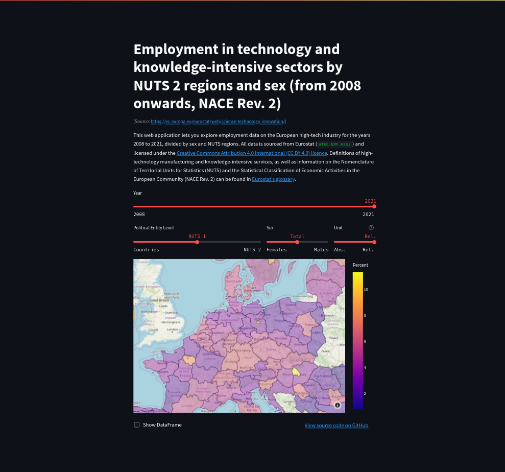

### nace_r2-htc-choropleth-app

A simple choropleth map visualizing Eurostat's employment data on the high-tech
industry and knowledge-intensive services, as defined by NACE Rev. 2 (data code:
HTEC_EMP_REG2). A definition of what comprises Eurostat's high-tech aggregation
can be found in its [Annex 3 – Aggregations of manufacturing based on NACE Rev. 2](https://ec.europa.eu/eurostat/cache/metadata/Annexes/htec_esms_an3.pdf).

The main goal of this project was to get my feet wet and become more familiar
with API requests, interactive geovisualization, app frameworks and OS-level
virtualization. The app was made using Streamlit and Plotly and is deployed
with Docker on AWS Elastic Beanstalk. You can check it out here: https://bit.ly/3SHiN2u
\
\
<picture>
  <source media="(prefers-color-scheme: light)" srcset="screenshot_light.png">
  <source media="(prefers-color-scheme: dark)" srcset="screenshot_dark.png">
  
</picture>

